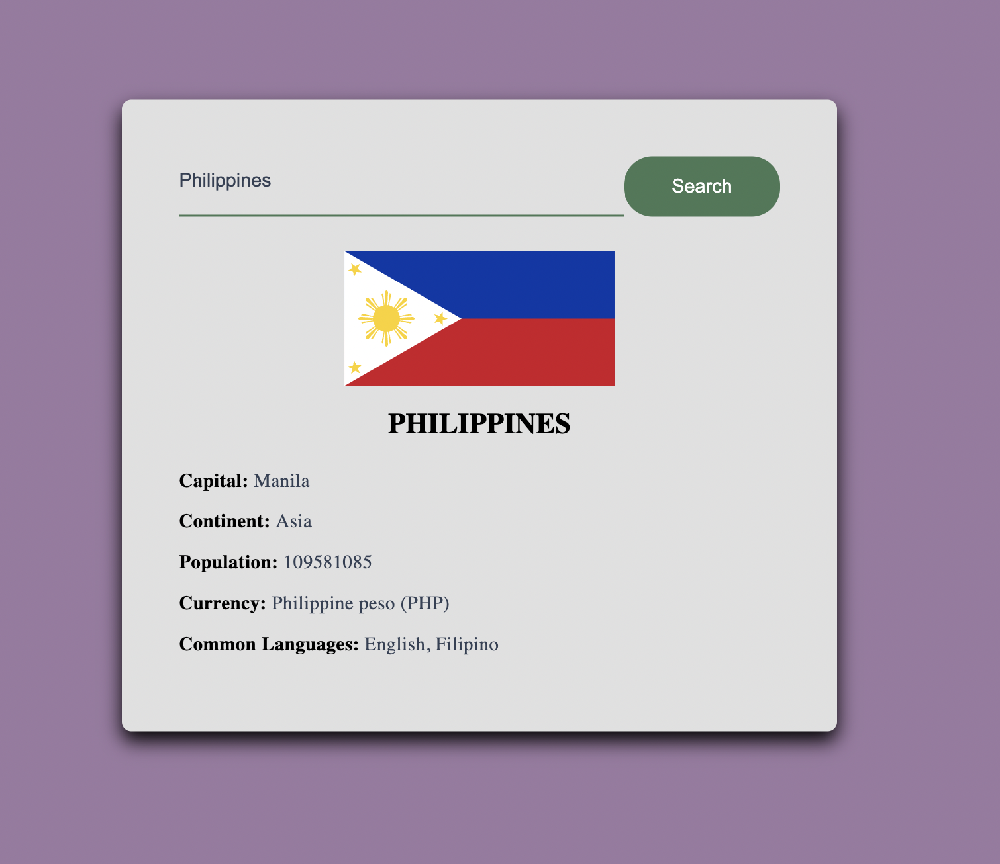

# Developer Portfolio

## Blackjack
Blackjack game made using OOA, OOD, and OOP processes

## Fortuneteller
Django application

## Flask Reddit Clone
Flask application

## Spotify Visualisation
Visualising my own spotify data using Spotipy and Pandas

## Number Guesser
Number guessing game made using Vanilla JavaScript, HTML, and CSS.

<figcaption>Screenshot of the game in browser</figcaption>

## Country Finder
Simple web application to find basic information about a country. The application consumes data from the public API https://restcountries.com/.

<figcaption>Screenshot of a search result for the Philippines</figcaption>

## Booksmarks REST API
Bookmarks REST API using Flask. Handles CRUD operations for web bookmarks using protected endpoints and user authentication. An API reference page was created using Swagger documentation. 

<figcaption>Screenshot of available endpoints documented in Swagger UI</figcaption>