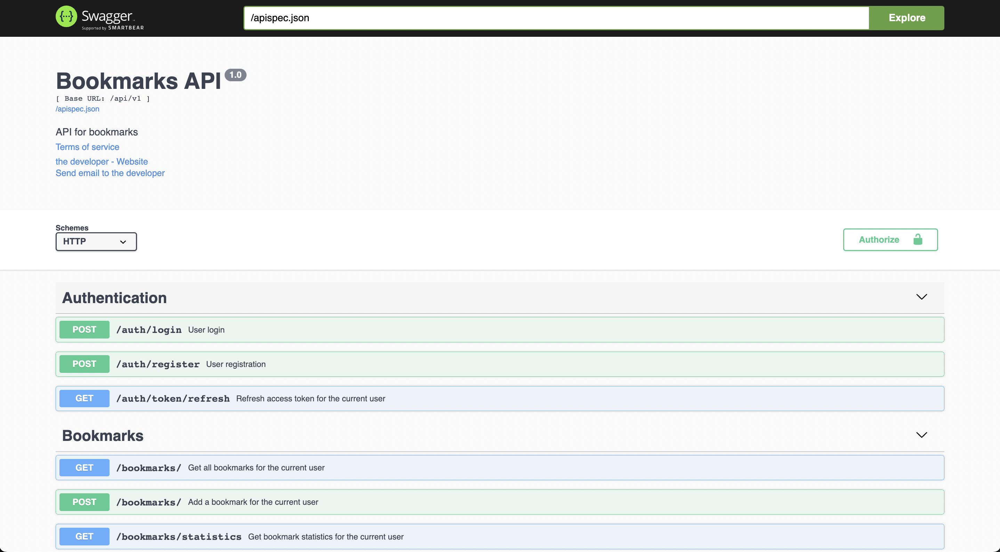
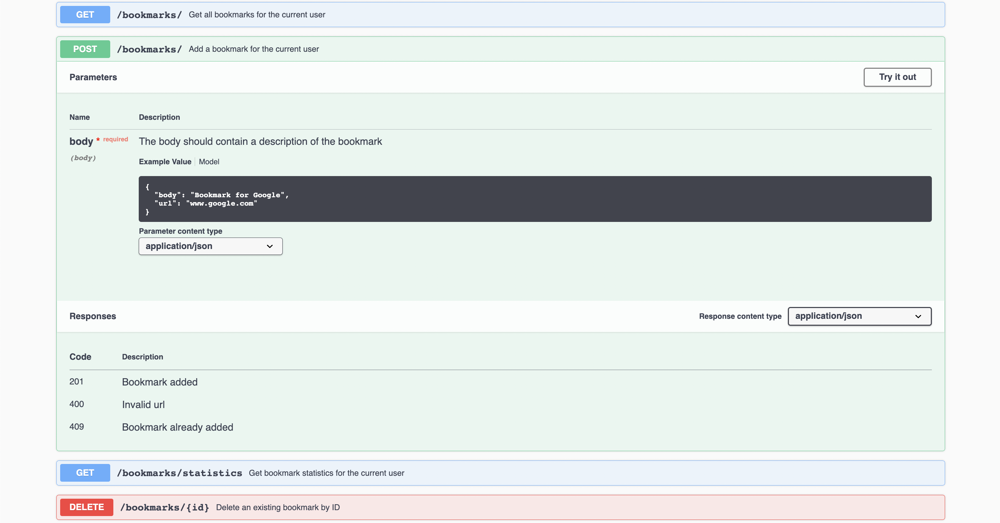

# Bookmarks REST API
Bookmarks REST API made using Flask. The application handles user authentication for all protected endpoints using JWT manager. The application allows for web bookmarks to be saved to a local RDBMS (postgreSQL). All CRUD operations can be made for a bookmark i.e. creating, reading, updating, and deleting bookmarks.

# Usage

Install the requirements into a virtual environment using:

```pip install -r requirements.txt```

To open the API reference use

```flask run```

and go to "http://127.0.0.1:5000/"


<figcaption>Screenshot of available endpoints documented in Swagger UI</figcaption>


<figcaption>Screenshot of the requirements for a POST request and an example of the required JSON input</figcaption>

# Future Work

<ul>
    <li>Deploy API using Heroku</li>
    <li>Create a static frontend that consumes from the API</li>
</ul>