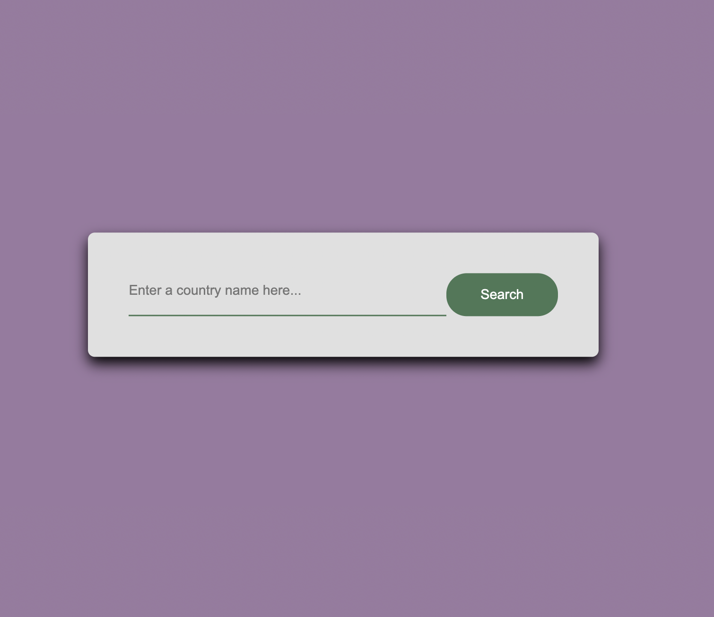

# Country Finder
Simple web application to find basic information about a country: name, capital, continent, population, currency, and common languages. 

The application was made using Vanilla JavaScript, HTML, and CSS. It consumes data from the public API https://restcountries.com/.

# Usage

The application can be ran locally using:

```npx live-server```


<figcaption>Screenshot of the frontend of the application</figcaption>


<figcaption>Screenshot of a search result for the Philippines</figcaption>

# Future Work

<ul>
    <li>Implement another API to get more information about a country (e.g. weather, time)
</ul>

