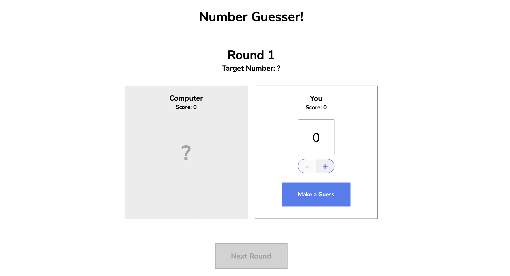

# Number Guesser 

Number guesser is a number guessing game made using Vanilla JavaScript, HTML, and CSS. A player chooses to guess a number between 0-9 and competes against to computer to see who can get closest to the randomly generated number. The player also wins if both the player and the computer guess the same number.



## Usage 

The game can played in the browser locally using:

```npx live-server```

