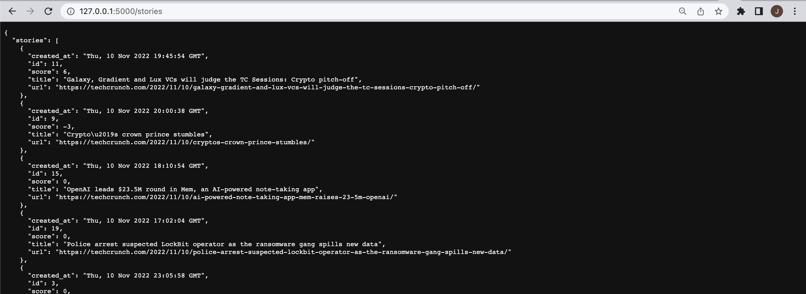
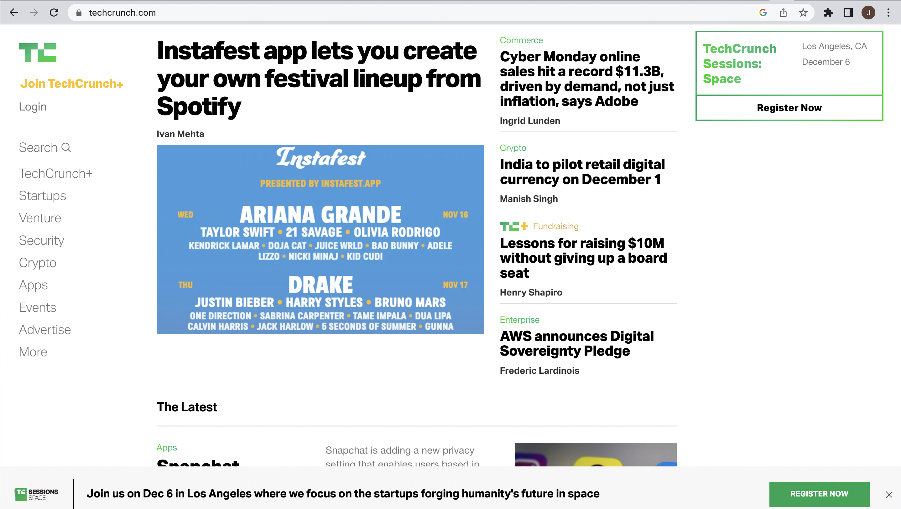
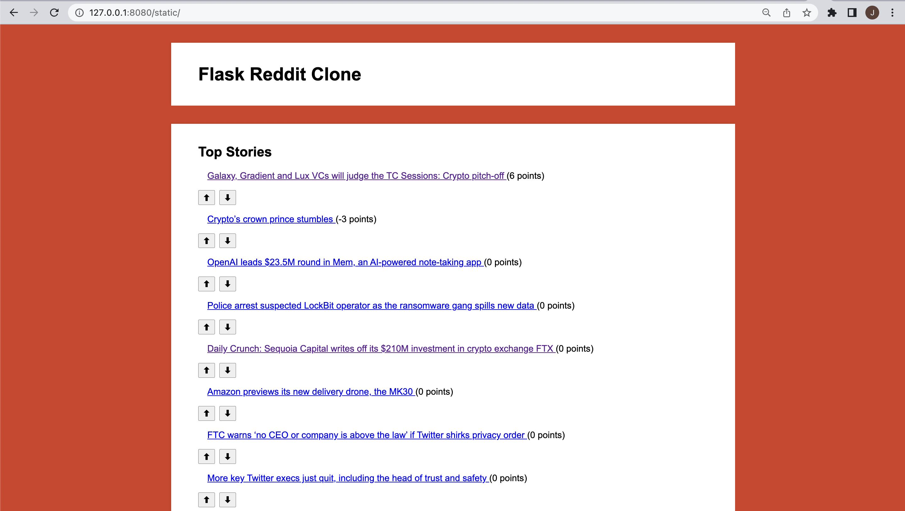

# Reddit Clone
Reddit Clone made using Flask backend and static frontend. The application uses Flask as a REST API which handles HTTP requests to a local RDBMS. The webscraper is used to scrape the top news headlines from "https://techcrunch.com/" and inserts the cleaned data into the RDBMS for use from the frontend. The REST API supports all CRUD operations for creating, reading, updating, deleting news stories.

## Flask REST API

API is designed around REST principles and provides end points that serve the frontend application with JSON data.



## Webscraper

The webscraper uses Psycopg2-binary to connect to a local postgreSQL database and insert data scraped from "https://techcrunch.com/". The data is gathered using BeautifulSoup to target all stories on the landing page; collecting the following data: title, url, and created date/time.



## Static Frontend 

The frontend for the application is a static webpage coded using Vanilla JavaScript, HTML, and CSS. 



# Usage

Install the requirements into a virtual environment using:

```pip install -r requirements.txt```

To run the application both the frontend and backend need run locally by running the following commands while within the required directory.

Frontend:

```npx live-server```

Backend: 

```python3 flask_api.py```

# Future Work

<ul>
    <li>Documentation of REST API with Swagger</li>
    <li>Deploy API and frontend using Heroku</li>
    <li>Create a dynamic frontend using JavaScript React framework</li>
</ul>